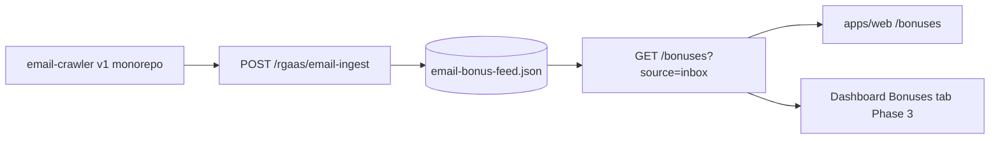

# Email-sourced bonuses (v2)

Architecture approved for inbox marketing offers. **No wallet or claim automation** — display only.

## Flow



| Layer | v1 (production today) | v2 (this repo) |
|-------|------------------------|----------------|
| Crawler | `tiltcheck-monorepo/scripts/email-crawler.ts` | `scripts/email-crawler.ts` (`pnpm crawl:emails`) |
| Ingest | `POST /rgaas/email-ingest` on production API | `POST /rgaas/email-ingest` on v2 API (parse + Supabase/JSON feed) |
| Read API | `GET /bonuses?source=inbox` | `GET /bonuses`, `GET /bonuses/inbox`, `GET /bonuses/picks` |
| Web | Legacy `tiltcheck.me/bonuses` | `/bonuses` — live inbox grid from your email feed |
| Dashboard | Legacy bonus hub | **Phase 3** — full list on Bonuses tab |

## v2 API contract

**`GET /bonuses/picks?limit=3`**

```json
{
  "success": true,
  "source": "email-inbox",
  "updatedAt": "2026-05-27T12:00:00.000Z",
  "limit": 3,
  "data": [
    {
      "id": "…",
      "casinoName": "McLuck",
      "offerTitle": "100% match …",
      "url": "https://…",
      "expiresAt": "2026-05-29T23:59:59.999Z",
      "expiryMessage": "expires in 2 days",
      "expiresSoon": true,
      "urgent": false,
      "source": "email-inbox"
    }
  ]
}
```

When upstream is down, `source` is `static-fallback` and `message` explains the placeholder cards.

Env:

| Variable | Purpose |
|----------|---------|
| `BONUSES_UPSTREAM_URL` | Base URL (default `https://api.tiltcheck.me/bonuses`) — v2 appends `?source=inbox&sort=urgency&limit=` |

## Future: Supabase

No `bonuses` table in initial migration. When added, v2 API can read from Supabase first and keep upstream as backfill.

## UX rules

- Show: casino name, offer title, expiry if known, **Expires soon** badge when `expiresSoon`
- Static fallback when API empty or unreachable
- Link to `/casinos` for trust context
