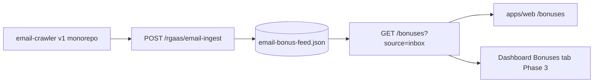

# Email-sourced bonuses (v2)

Architecture approved for inbox marketing offers. **No wallet or claim automation** — display only.

Last Updated: 2026-06-16

## Flow



| Layer | v1 (production today) | v2 (this repo) |
|-------|------------------------|----------------|
| Crawler | `tiltcheck-monorepo/scripts/email-crawler.ts` | `scripts/email-crawler.ts` (`pnpm crawl:emails`) |
| Ingest | `POST /rgaas/email-ingest` on production API | `POST /rgaas/email-ingest` on v2 API (parse + Supabase/JSON feed) |
| Read API | `GET /bonuses?source=inbox` | `GET /bonuses`, `GET /bonuses/inbox`, `GET /bonuses/picks`, `GET /bonuses/daily-feed` |
| Web | Legacy `tiltcheck.me/bonuses` | `/bonuses` — unified daily feed (CollectClock + inbox + cache) |
| Dashboard | Legacy bonus hub | **Phase 3** — full list on Bonuses tab |

## v2 API contract

**`GET /bonuses/daily-feed?usOnly=true`**

Unified aggregator merging CollectClock upstream, active email inbox entries, and local `data/bonus-data.json` cache. US casino matching uses `data/sweepstakes-casinos.json` when present, otherwise `packages/trust/src/casinos.json` (Sweeps + Regulated categories).

Query:

| Param | Default | Description |
|-------|---------|-------------|
| `usOnly` | `true` | When `true`, only entries matched to US sweepstakes/regulated casinos are returned. Pass `usOnly=false` for the full merged feed. |

```json
{
  "success": true,
  "updatedAt": "2026-06-16T12:00:00.000Z",
  "total": 42,
  "usTotal": 38,
  "data": [
    {
      "id": "mcluck::daily login::https://mcluck.com/",
      "brand": "McLuck",
      "bonus": "Daily login reward",
      "url": "https://mcluck.com/",
      "verified": "2026-06-16T10:00:00.000Z",
      "code": null,
      "sources": ["collectclock", "email-inbox"],
      "bonusType": "Daily",
      "bonusValue": "1 SC",
      "expiresAt": null,
      "expiryMessage": null,
      "imageUrl": null,
      "isUsCasino": true,
      "casinoCategory": "Sweeps",
      "trustScore": null
    }
  ],
  "sources": [
    { "key": "email-inbox", "label": "Email inbox", "available": true, "count": 12, "updatedAt": "...", "detail": "12 inbox promos parsed" },
    { "key": "collectclock", "label": "CollectClock", "available": true, "count": 35, "updatedAt": "...", "detail": "35 CollectClock entries" },
    { "key": "local-fallback", "label": "Local cache", "available": false, "count": 0, "updatedAt": null, "detail": "No local cache" }
  ]
}
```

**`GET /bonuses/picks?limit=3`**

```json
{
  "success": true,
  "source": "email-inbox",
  "updatedAt": "2026-05-27T12:00:00.000Z",
  "limit": 3,
  "data": [
    {
      "id": "…",
      "casinoName": "McLuck",
      "offerTitle": "100% match …",
      "url": "https://…",
      "expiresAt": "2026-05-29T23:59:59.999Z",
      "expiryMessage": "expires in 2 days",
      "expiresSoon": true,
      "urgent": false,
      "source": "email-inbox"
    }
  ]
}
```

When upstream is down, `source` is `static-fallback` and `message` explains the placeholder cards.

Env:

| Variable | Purpose |
|----------|---------|
| `BONUSES_UPSTREAM_URL` | Base URL (default `https://api.tiltcheck.me/bonuses`) — v2 appends `?source=inbox&sort=urgency&limit=` |

## Future: Supabase

No `bonuses` table in initial migration. When added, v2 API can read from Supabase first and keep upstream as backfill.

## UX rules

- Show: casino name, offer title, expiry if known, **Expires soon** badge when `expiresSoon`
- Static fallback when API empty or unreachable
- Link to `/casinos` for trust context
