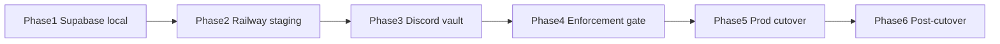

# Implementation Plan: TiltCheck v2 Staging + Cutover

**Created:** 2026-05-27  
**Source specification:** [docs/phases.md](../phases.md), [docs/manual-tasks.md](../manual-tasks.md)  
**Repo:** https://github.com/jmenichole/tiltcheckmvp  
**Notion spec link:** _(paste Notion page URL here when using tasks-plan from Notion)_

---

## Overview

Deploy TiltCheck v2 to **Railway staging**, prove the **protected session loop** (Discord login → vault rule → extension Touch Grass enforcement), then cut over production DNS. Application code is largely complete; this plan covers **infra, env, manual QA, and cutover** only.

**North-star acceptance:** One staging user completes login → sets `session_cap` vault → triggers critical tilt → sees fullscreen enforcement until timer expires.

---

## Technical approach

| Layer | Approach |
|-------|----------|
| **Hosting** | Two Railway services (web + api) from `main`, monorepo root build |
| **Database** | Supabase Postgres; migration + `pnpm seed:casino-scores` |
| **Auth** | Discord OAuth on API; web handoff via `/api/auth/complete` → `tc_session` cookie |
| **Extension** | Unpacked staging build with `EXTENSION_API_URL` pointing at staging API |
| **Trust data** | DB-backed scores with static fallback (Phase 1 OK without live feed) |
| **Bonuses** | Optional; v2 proxies v1 via `BONUSES_UPSTREAM_URL` — not a cutover blocker |
| **v1 parallel** | Email crawler stays on v1 monorepo → `api.tiltcheck.me` until v2 ingest |

---

## Phase 1 — Foundation (Supabase + local verify)

**Goal:** Database live; local stack proves API scores and pages.

### Tasks

- [ ] Create Supabase **staging** project
- [ ] Run `supabase/migrations/20260527000000_initial.sql`
- [ ] Set `SUPABASE_URL` + `SUPABASE_SERVICE_ROLE_KEY` in local `.env`
- [ ] Run `pnpm seed:casino-scores`
- [ ] Start API + web locally; verify `/casinos` and `GET /rgaas/casino-scores`
- [ ] Confirm GitHub `main` is current (Railway will deploy from here)

### Acceptance criteria

- Seed script exits 0 with row count logged
- API casino-scores returns casinos (DB or merged static)
- Web home + casino directory render without errors

### Estimate: 1–2 hours

---

## Phase 2 — Railway staging deploy

**Goal:** Public staging URLs for web + api with correct env.

### Tasks

- [ ] Railway: create **api** service (`apps/api/railway.toml` or deploy.md commands)
- [ ] Railway: create **web** service (`apps/web/railway.toml`)
- [ ] Configure API env: `WEB_URL`, `API_URL`, `SESSION_SECRET`, Discord vars, Supabase vars
- [ ] Configure web env: `NEXT_PUBLIC_WEB_URL`, `NEXT_PUBLIC_API_URL`, `NEXT_PUBLIC_SHOW_TOOLS_NAV=false`
- [ ] Deploy both; verify `GET <api>/health`
- [ ] Optional: custom DNS `staging.tiltcheck.me` + `api-staging.tiltcheck.me`; update env + redeploy

### Acceptance criteria

- Staging web loads `/`, `/casinos`, `/extension`
- Staging API health + casino-scores green
- No secrets committed to git

### Estimate: 2–3 hours

---

## Phase 3 — Discord OAuth + dashboard

**Goal:** Authenticated session on staging web.

### Tasks

- [ ] Discord Developer Portal: add staging callback `https://<api-host>/auth/discord/callback`
- [ ] Add production callback URL (for later) in same app
- [ ] Test `/login` → Discord → redirect to `/dashboard`
- [ ] Verify `tc_session` cookie on web domain
- [ ] Dashboard **Vault** tab: create `session_cap` rule via `POST /vault`
- [ ] Refresh page — rule persists (Supabase, not stub)

### Acceptance criteria

- Unauthenticated `/dashboard` redirects to login
- Vault rule survives page reload
- Profile tab shows Discord identity

### Dependencies: Phase 2

### Estimate: 1 hour

---

## Phase 4 — Extension staging + enforcement gate

**Goal:** Protected session proven on staging — **blocks production cutover**.

### Tasks

- [ ] Build extension: `EXTENSION_API_URL=https://<staging-api> pnpm --filter @tiltcheck/extension build`
- [ ] Load unpacked in Chrome
- [ ] Extension Discord login; `tc_demo: false`, token in storage
- [ ] Extension syncs vault from API
- [ ] Open test casino page; trigger **critical** tilt
- [ ] Confirm Touch Grass overlay + `[TiltCheck] Enforcement fired` in service worker
- [ ] Run `pnpm test:e2e` locally or confirm CI green on `main`

### Acceptance criteria

Per [cutover-checklist.md](../cutover-checklist.md) — all six enforcement bullets pass on staging.

### Dependencies: Phase 3

### Estimate: 2–4 hours (includes tilt repro tuning)

---

## Phase 5 — Production cutover

**Goal:** DNS to v2; users re-auth; extension points at prod API.

### Tasks

- [ ] Production Supabase: migrate + seed
- [ ] Railway production envs (or duplicate services)
- [ ] Re-run Phase 1 smoke + Phase 4 enforcement on prod hostnames
- [ ] DNS: `tiltcheck.me` → web, `api.tiltcheck.me` → api
- [ ] Redirect `dashboard.tiltcheck.me` → `/dashboard`
- [ ] Chrome Web Store update: `EXTENSION_API_URL=https://api.tiltcheck.me`
- [ ] Archive `tiltcheck-monorepo` read-only
- [ ] Keep v1 email crawler on prod API until v2 ingest

### Acceptance criteria

- Production smoke matches staging gate
- v1 marketing replaced by v2 without breaking extension loop

### Dependencies: Phase 4 green on staging

### Estimate: 2–3 hours (+ DNS propagation wait)

---

## Phase 6 — Post-cutover (deferred)

Not required for cutover. Order from [phases.md](../phases.md):

1. Dashboard **Analytics** tab + API
2. **Buddies** (simplified)
3. Dashboard **Bonuses** full list (public `/bonuses` picks already exist)
4. Tools: session-stats → verify → house-edge
5. Discord bot on Railway

---

## Dependencies summary

---

## Risks and mitigations

| Risk | Mitigation |
|------|------------|
| Notion MCP down — can't track in Notion | Use this doc + manual-tasks.md until MCP connected |
| Discord redirect mismatch | Match exact API callback URL in Discord app and Railway `API_URL` |
| Live casino feed unavailable | STATIC fallback OK for Phase 1; seed optional for Phase 2 |
| Empty `/bonuses` | Not a cutover blocker; run v1 crawler separately |
| Extension ID / CWS delay | Keep legacy store extension until v2 build validated on staging |
| EPERM on `pnpm install` (Windows) | Use `npx pnpm@9.15.0 install --config.node-linker=isolated` |

---

## Out of scope for this plan

- New product features beyond Phase 1/2 gates
- v2 email ingest migration
- Operators/RGaaS portal, wallet stack, game-arena
- SSH deploy keys (Railway uses GitHub integration)

---

## Next actions (start here)

1. Supabase staging + seed (Phase 1)
2. Railway api + web deploy (Phase 2)
3. Discord OAuth test (Phase 3)

**When Notion MCP is connected:** duplicate tasks from Phases 1–5 into your task board, or say `/tasks-plan` with a Notion spec URL to sync this plan into Notion automatically.
