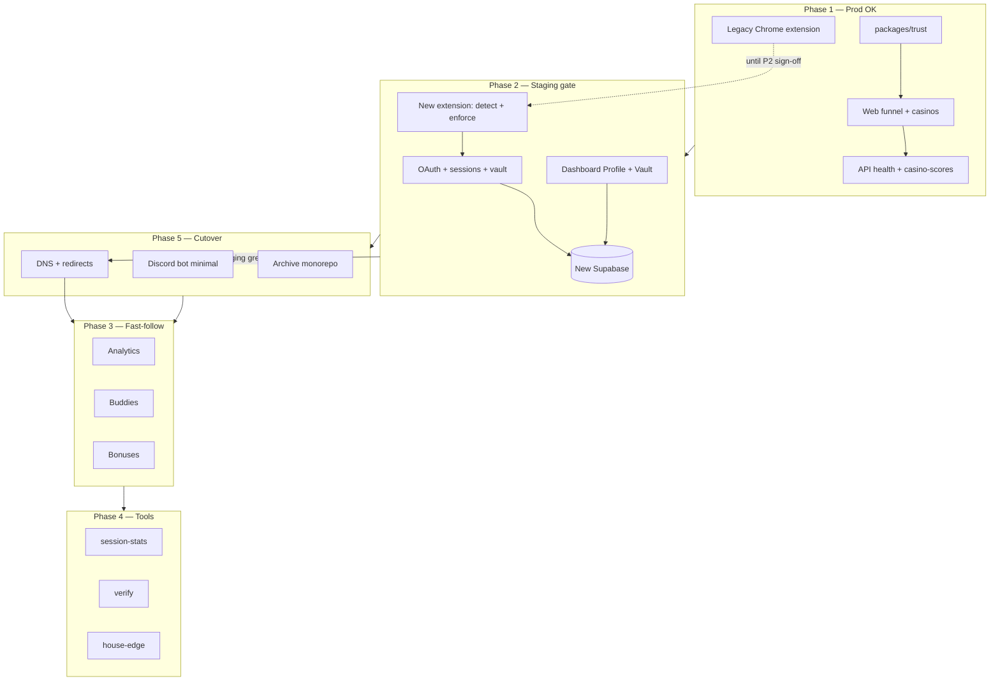

# TiltCheck greenfield — combined phase plan

**Source of truth** for what ships when. Acquisition (marketing + trust) and the protected session loop are merged so Phase 1 can go to production for marketing while Phase 2 must pass staging before DNS cutover.

## Cutover rule

| Environment | Phases allowed | Notes |
|-------------|----------------|-------|
| **Production** (`tiltcheck.me`) | Phase 1 only until Phase 2 staging sign-off | Old Chrome extension in the store remains the live protector |
| **Staging** | Phases 1 + 2 together | Full loop: install → login → vault → casino test → enforcement |
| **Production cutover** | Phases 1 + 2 | Only after staging ship gate passes; then DNS + dashboard redirect |

Do not point production DNS at the new stack until Phase 2 staging gate is green.

---

## Phase 1 — Trust + install funnel (prod OK for marketing)

**Goal:** Prove trust, drive extension installs, no dependency on new auth/vault in prod.

| Area | Deliverables |
|------|----------------|
| **Web** | `/`, `/extension`, `/casinos`, `/casinos/[slug]`, legal (`/privacy`, `/terms`, `/legal`) |
| **packages/trust** | Casino catalog + score helpers; trust-only data migration from v1 |
| **API (minimal)** | `GET /health`, `GET /rgaas/casino-scores` |
| **Extension** | Old extension in Chrome Web Store still OK; **new** extension not required for Phase 1 |

**Ship gate (production):**

- Marketing site live with hero + extension CTAs
- Casino directory and slug pages work (static + API fallback)
- CTAs point users to install the **existing** store extension

---

## Phase 2 — Protected session loop (BLOCKS production cutover)

**Goal:** One user can log in, configure vault rules in new Supabase, and see tilt enforcement on a test casino.

| Area | Deliverables |
|------|----------------|
| **API** | Discord OAuth (`web_` / `ext_` state), sessions, user settings, vault CRUD (persisted) |
| **Extension** | Tilt detection + **one** enforced exit path; demo mode when logged out; API sync for auth + vault |
| **Web** | `/login`, `/dashboard` with **Profile + Vault only** (fully working) |
| **Data** | Users re-login; vault lives in **new** Supabase (not v1) |

**Ship gate (staging only):**

1. Install extension (staging build)
2. Discord login (web or ext)
3. Set vault rules in dashboard
4. Open test casino → tilt signal → **enforcement fires** (exit/block)

Until this gate passes, production stays on Phase 1 + legacy extension.

---

## Phase 3 — Dashboard depth (post-cutover fast-follow)

Ship in order after cutover:

1. **Analytics** — session summary
2. **Buddies** — social/accountability (simplified)
3. **Bonuses** — full inbox list on Dashboard **Bonuses** tab; public **Today's picks** (2–3 cards) already on `/bonuses` ([bonuses.md](./bonuses.md)); crawler stays on v1 until ingest migrates

Not required for DNS cutover.

---

## Phase 4 — Tools (after Phase 2 stable)

One web page + one API module per tool, in order:

1. **session-stats**
2. **verify** (domain / casino verifier)
3. **house-edge**

Defer extra tools until the core loop is stable in production.

---

## Phase 5 — Discord + cutover

| Item | Scope |
|------|--------|
| **Discord bot** | Minimal: `/vault status`, alert webhook |
| **DNS** | Cutover `tiltcheck.me`; `dashboard.tiltcheck.me` → `/dashboard` redirect on web app |
| **Legacy** | Archive `tiltcheck-monorepo` (read-only reference) |

---

## Roadmap diagram

---

## Single backlog queue

Work top to bottom; do not start a lower block until the block above is done or explicitly deferred.

### Phase 2 — staging gate (must pass before DNS)

1. **P2** — Staging manual gate: extension build → Discord login → vault save → enforcement fires
2. **P2** — Run `pnpm test:e2e` green on `main`
3. **P2 fast-follow** — Port `/touch-grass` page — **done**
4. **P2 fast-follow** — `GET /rgaas/casino-lookup?q=` — **done**
5. **P2 fast-follow** — `GET /rgaas/domain-check` + wire domain-verifier UI — **done**
6. **P3** — Port `/stake` and `/nuts` AutoVault install pages — **done** (verify on staging)
7. **P2 fast-follow** — `GET /rgaas/profile/:userId` — server-side tilt history for vault enrichment (optional for gate)

### Phase 2 — done in repo (pending staging sign-off)

- Discord OAuth + sessions, vault CRUD, dashboard Profile + Vault, extension enforcement + vault sync
- Web UI polish, footer, Phase 2 spec — see [manual-tasks.md](./manual-tasks.md)

### Phase 3 — post-cutover fast-follow

6. **P3** — Analytics tab + session summary API
7. **P3** — Buddies (simplified accountability)
8. **P3** — Bonuses dashboard tab + full inbox list
9. **P3** — Wire `/tools/scan-scams` to richer scam intel (blacklist wired; expand sources)
12. **P3** — `GET /rgaas/license-check` endpoint
13. **P3** — `GET /stats` KPI strip → homepage hero
14. **P3** — CollectClock bonus timers under `/bonuses`
15. **P3** — `POST /rgaas/breathalyzer/evaluate` + `POST /rgaas/anti-tilt/evaluate`
16. **P3** — `POST /newsletter` + form on web
17. **P3** — Port `/microgrant` page (form disabled until funded)

### Phase 4 — tools depth

18. **P4** — session-stats (drift monitor)
19. **P4** — verify (manual bet HMAC re-calculator — not domain scanner)
20. **P4** — house-edge scanner (client-side calculator)
21. **P4** — `/intel/rtp` RTP database page
22. **P4** — `POST /rgaas/rtp/report` + `GET /rgaas/rtp/discrepancy/:platform`
23. **P4** — `GET /rgaas/shadow-bans`, scam-domains depth, telemetry

### Phase 5 — cutover + B2B

24. **P5** — Staging sign-off → production DNS (`tiltcheck.me`, `api.tiltcheck.me`)
25. **P5** — Discord bot `/vault status` + webhook
26. **P5** — `dashboard.tiltcheck.me` → 301 `/dashboard`; archive v1 monorepo
27. **P5** — Operators pages (`/operators`, pricing, API keys)
28. **P5** — Stripe billing, partner API, `POST /rgaas/email-ingest`

### Defer / archive (low solo-degen PMF)

- `/blog`, `/docs`, `/ask` (AI chat), `/collab`, `/beta-tester`, Degens Arena page (link external), JustTheTip, WebSocket `/analyzer`, OIDC Magic TEE

---

## Current status (repo snapshot)

_Last updated: execution plan implementation (docs + trust API + vault + extension + E2E)._

### Phase 1 — ready for Railway staging

| Item | Status |
|------|--------|
| Web routes (`/`, `/extension`, `/casinos`, `/casinos/[slug]`, legal) | **Done** |
| `packages/trust` + `casinos.json` | **Done** — v1 catalog ported |
| `GET /health` | **Done** |
| `GET /rgaas/casino-scores` | **Done** — DB merge + static fallback; v1 JSON shape |
| Trust seed | **Script** — `pnpm seed:casino-scores` → Supabase `casino_scores` |
| `/tools/*` primary nav | **Hidden** — pages remain with `noindex` |
| [tech-stack.md](./tech-stack.md) + [deploy.md](./deploy.md) (Railway) | **Done** |
| Production deploy | **Manual** — Railway web + api + Supabase staging |

### Phase 2 — implemented; needs env + staging sign-off

| Item | Status |
|------|--------|
| Discord OAuth + sessions | **Done** — ext callback passes token to opener |
| Vault CRUD | **Done** — POST/PATCH/DELETE via `packages/db` (no `stub: true`) |
| `session_cap` rule type | **Done** — dashboard + API validation |
| Extension enforcement | **Done** — Touch Grass overlay on high/critical tilt |
| Extension vault sync | **Done** — Bearer token + `/vault` fetch |
| `/login`, `/dashboard` | **Done** |
| Dashboard Profile + Vault only | **Done** |
| Playwright smoke + CI | **Done** — `pnpm test:e2e` |
| Staging manual gate | **Pending** — install → login → vault → enforcement on staging |

### Phase 3 — not started

| Item | Status |
|------|--------|
| Analytics | **Not started** |
| Buddies | **Removed from dashboard nav** (Phase 3) |
| Bonuses | **Partial** — `/bonuses` Today's picks + API proxy; Dashboard tab + full list in Phase 3 |

### Phase 4 — stubs, deferred

| Item | Status |
|------|--------|
| Web `/tools/*` pages | **Stub** — noindex, not in primary nav |
| API `/tools/*` | **Stub responses** |

### Phase 5 — partial

| Item | Status |
|------|--------|
| `apps/discord` | **Partial** — `/vault status` calls API when env set |
| DNS / redirects | **Documented** in [cutover-checklist.md](./cutover-checklist.md) |
| [v1-ops.md](./v1-ops.md) | **Done** — crawler + archive steps |
| Archive monorepo | **Manual** — after cutover |

---

## Related docs

- [migration-from-v1.md](./migration-from-v1.md) — trust data and user cutover notes
- [deploy.md](./deploy.md) — hosting and env
- [cutover-checklist.md](./cutover-checklist.md) — DNS and redirect checklist
