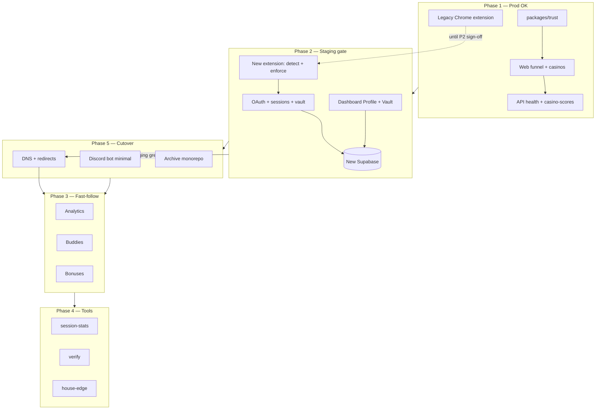

# TiltCheck greenfield — combined phase plan

**Source of truth** for what ships when. Acquisition (marketing + trust) and the protected session loop are merged so Phase 1 can go to production for marketing while Phase 2 must pass staging before DNS cutover.

## Cutover rule

| Environment | Phases allowed | Notes |
|-------------|----------------|-------|
| **Production** (`tiltcheck.me`) | Phase 1 only until Phase 2 staging sign-off | Old Chrome extension in the store remains the live protector |
| **Staging** | Phases 1 + 2 together | Full loop: install → login → vault → casino test → enforcement |
| **Production cutover** | Phases 1 + 2 | Only after staging ship gate passes; then DNS + dashboard redirect |

Do not point production DNS at the new stack until Phase 2 staging gate is green.

---

## Phase 1 — Trust + install funnel (prod OK for marketing)

**Goal:** Prove trust, drive extension installs, no dependency on new auth/vault in prod.

| Area | Deliverables |
|------|----------------|
| **Web** | `/`, `/extension`, `/casinos`, `/casinos/[slug]`, legal (`/privacy`, `/terms`, `/legal`) |
| **packages/trust** | Casino catalog + score helpers; trust-only data migration from v1 |
| **API (minimal)** | `GET /health`, `GET /rgaas/casino-scores` |
| **Extension** | Old extension in Chrome Web Store still OK; **new** extension not required for Phase 1 |

**Ship gate (production):**

- Marketing site live with hero + extension CTAs
- Casino directory and slug pages work (static + API fallback)
- CTAs point users to install the **existing** store extension

---

## Phase 2 — Protected session loop (BLOCKS production cutover)

**Goal:** One user can log in, configure vault rules in new Supabase, and see tilt enforcement on a test casino.

| Area | Deliverables |
|------|----------------|
| **API** | Discord OAuth (`web_` / `ext_` state), sessions, user settings, vault CRUD (persisted) |
| **Extension** | Tilt detection + **one** enforced exit path; demo mode when logged out; API sync for auth + vault |
| **Web** | `/login`, `/dashboard` with **Profile + Vault only** (fully working) |
| **Data** | Users re-login; vault lives in **new** Supabase (not v1) |

**Ship gate (staging only):**

1. Install extension (staging build)
2. Discord login (web or ext)
3. Set vault rules in dashboard
4. Open test casino → tilt signal → **enforcement fires** (exit/block)

Until this gate passes, production stays on Phase 1 + legacy extension.

---

## Phase 3 — Dashboard depth (post-cutover fast-follow)

Ship in order after cutover:

1. **Analytics** — session summary
2. **Buddies** — social/accountability (simplified)
3. **Bonuses** — simplified offers surface

Not required for DNS cutover.

---

## Phase 4 — Tools (after Phase 2 stable)

One web page + one API module per tool, in order:

1. **session-stats**
2. **verify** (domain / casino verifier)
3. **house-edge**

Defer extra tools until the core loop is stable in production.

---

## Phase 5 — Discord + cutover

| Item | Scope |
|------|--------|
| **Discord bot** | Minimal: `/vault status`, alert webhook |
| **DNS** | Cutover `tiltcheck.me`; `dashboard.tiltcheck.me` → `/dashboard` redirect on web app |
| **Legacy** | Archive `tiltcheck-monorepo` (read-only reference) |

---

## Roadmap diagram

---

## Single backlog queue

Work top to bottom; do not start a lower block until the block above is done or explicitly deferred.

1. **P1** — Polish casino slug SEO/copy; wire `casino-scores` to v1 migration data; production deploy web + API read paths
2. **P1** — Verify all legal routes and extension CTAs match live marketing
3. **P2** — Wire vault POST/PATCH/DELETE to Supabase (remove API stubs)
4. **P2** — Extension: session cookie sync, vault fetch, enforcement on `critical` tilt
5. **P2** — Dashboard: Profile + Vault UX complete; drop or hide non-MVP tabs
6. **P2** — Staging E2E script (install → login → vault → test casino)
7. **P5** — Staging sign-off → production DNS
8. **P3** — Analytics tab + API
9. **P3** — Buddies (simplified)
10. **P3** — Bonuses (simplified)
11. **P4** — session-stats
12. **P4** — verify
13. **P4** — house-edge
14. **P5** — Discord `/vault` + webhook
15. **P5** — `dashboard.tiltcheck.me` redirect; archive old monorepo

---

## Current status (repo snapshot)

_Last updated when combined phase plan was adopted._

### Phase 1 — mostly scaffolded, needs data + deploy

| Item | Status |
|------|--------|
| Web routes (`/`, `/extension`, `/casinos`, `/casinos/[slug]`, legal) | **Present** — pages exist |
| `packages/trust` + `casinos.json` | **Present** — static catalog |
| `GET /health` | **Done** |
| `GET /rgaas/casino-scores` | **Stub** — returns trust package / empty DB without migration |
| v1 trust data migration | **Not done** — see [migration-from-v1.md](./migration-from-v1.md) |
| Production deploy | **Not done** |

### Phase 2 — partial; blocks cutover

| Item | Status |
|------|--------|
| Discord OAuth + sessions | **Scaffolded** — routes exist; needs env + Supabase |
| User settings API | **Scaffolded** — works with Supabase or in-memory fallback |
| Vault CRUD | **Read** wired; **POST stub** (`stub: true` in API) |
| Extension tilt detector | **Scaffolded** — logic present, minimal background |
| Extension enforcement + API sync | **Stub** — sidebar/background not production-ready |
| `/login`, `/dashboard` | **Present** |
| Dashboard Profile + Vault only | **Gap** — extra tabs (`safety`, `buddies`) ahead of plan; vault UI minimal |
| Staging E2E gate | **Not run** |

### Phase 3 — not started (UI stubs only)

| Item | Status |
|------|--------|
| Analytics | **Not started** |
| Buddies | **Dashboard tab stub** |
| Bonuses | **Not started** |

### Phase 4 — stubs ahead of schedule

| Item | Status |
|------|--------|
| Web `/tools/*` pages | **2 stub pages** (scan-scams, domain-verifier) — defer per plan |
| API `/tools/*` | **Stub responses** |

### Phase 5 — scaffold only

| Item | Status |
|------|--------|
| `apps/discord` | **Scaffold** — `/vault` returns stub text |
| DNS / redirects | **Documented** in [cutover-checklist.md](./cutover-checklist.md) |
| Archive monorepo | **Not done** |

---

## Related docs

- [migration-from-v1.md](./migration-from-v1.md) — trust data and user cutover notes
- [deploy.md](./deploy.md) — hosting and env
- [cutover-checklist.md](./cutover-checklist.md) — DNS and redirect checklist
