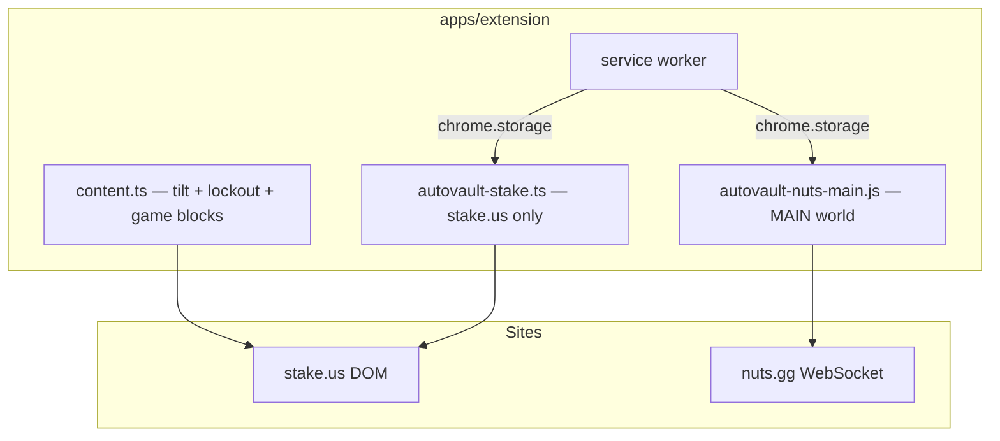

# Extension Auto-Vault — Scope (Track 4)

**Date:** 2026-05-27  
**Status:** Shipped (v1 in extension 2.1.0)  
**Priority:** P2 (after protection loop + site IA)  
**Related:** [Phase 2 protected session](./2026-06-07-phase-2-protected-session-design.md), userscript `apps/web/public/userscripts/tiltcheck-autovault-share.user.js`

---

## 1. Problem & goal

**Problem:** Auto-vault today ships as a Tampermonkey userscript (~1.5k lines). Degens must install a second tool. The main TiltCheck extension already runs at point-of-play for tilt lockout and game blocks, but does not skim wins to the casino balance vault.

**Goal:** Run Stake.us + nuts.gg auto-vault **natively in the Chrome extension** with the same behavior as the share userscript — no Tampermonkey — while keeping tilt protection and vault skim as separate, composable modules.

**Non-goals (v1):**
- Folding autovault UI into the general TiltCheck FAB sidebar
- Cross-casino vault beyond stake.us / nuts.gg
- Custodial vault or TiltCheck-held funds

---

## 2. Feasibility summary

| Requirement | Userscript today | Extension approach |
|-------------|------------------|-------------------|
| Stake.us DOM (`data-testid`, balance observers) | Isolated page script | Content script on `*://stake.us/*` — **works** |
| nuts.gg WebSocket hook (`WebSocket.prototype.send`) | `document-start`, page context | **MAIN world** injected script at `document_start` — required |
| Config persistence | `localStorage` / `sessionStorage` on page | Extension `chrome.storage` + optional page bridge; **cannot** read page `localStorage` from isolated world |
| CSP bypass | Userscript manager injects | Extension injection bypasses page CSP — **works** |
| iframes (game embeds) | Same-origin parent | May need `all_frames: true` for some observers |
| Permissions | `@grant none` | Current manifest: `storage`, `activeTab`, `<all_urls>` — sufficient for host access |

**Verdict:** Feasible as a **dedicated extension module**, not a small patch to the existing sidebar. Largest lift is MAIN-world WS hook for nuts.gg and porting ~1.5k lines of balance/vault/rate-limit logic.

---

## 3. Proposed architecture

### Module split

| Module | World | `run_at` | Hosts |
|--------|-------|----------|-------|
| Tilt / lockout / game blocks (existing) | ISOLATED | `document_idle` | `<all_urls>` (casino allowlist in code) |
| Auto-vault Stake | ISOLATED | `document_idle` | `*://stake.us/*`, `*://*.stake.us/*` |
| Auto-vault nuts WS engine | **MAIN** | `document_start` | `*://nuts.gg/*`, `*://*.nuts.gg/*` |
| Auto-vault nuts UI / bridge | ISOLATED | `document_idle` | same as nuts |

Stake and nuts share config shape via `chrome.storage.local` (`tc_autovault_config`). UI: floating toggle drawer (reuse userscript UX), **not** merged into TiltCheck FAB unless user explicitly opens “Vault skim” from panel link.

---

## 4. Work breakdown

### Phase A — Scaffold — **done**
- [x] Manifest entries for stake + nuts (`autovault.js`, `autovault-nuts-main.js` MAIN world)
- [x] Shared types + `chrome.storage` / `chrome.storage.session` adapter
- [x] Site auto-detect + hostname watcher switches Stake ↔ nuts engines

### Phase B — Stake.us port — **done**
- [x] GraphQL balance polling, profit/deposit skim, CF backoff, rate limits

### Phase C — nuts.gg port — **done**
- [x] MAIN-world WebSocket hook + isolated bridge via `postMessage`

### Phase D — Integration — **partial**
- [x] Floating AutoVault panel (separate from tilt FAB); site label in header
- [ ] Extension options page toggle per site
- [ ] Userscript page CTA → extension primary
- [ ] Staging sign-off checklist

**Estimate:** ~1–1.5 weeks focused solo work.

---

## 5. Risks & mitigations

| Risk | Mitigation |
|------|------------|
| Stake/nuts DOM changes break selectors | Keep userscript as fallback; shared selector map in `packages/shared` |
| MAIN-world injection blocked by MV3 policy changes | Isolate nuts module; document minimum Chrome version |
| Two UIs on same tab (FAB + vault drawer) | Separate anchors; autovault drawer bottom-right, FAB unchanged |
| Storage migration from userscript | One-time import prompt if page `localStorage` keys detected via injected probe |

---

## 6. Acceptance criteria

1. User with only the TiltCheck extension (no Tampermonkey) can enable auto-vault on stake.us and skim a test win to vault.
2. Same on nuts.gg via WS path.
3. Tilt lockout + game blocks continue to work on the same tab without regression.
4. Config survives browser restart via `chrome.storage`.
5. Userscript download page shows extension as primary install path.

---

## 7. Dependencies

- Phase 2 protection loop shipped (tilt warnings, lockout, game blocks) — **done**
- Extension Discord auth + settings sync — **done**
- No new API endpoints required for v1 (non-custodial, client-only skim)

---

## 8. Decision log

| Date | Decision |
|------|----------|
| 2026-05-27 | Do **not** embed full autovault in general sidebar; ship as site-specific content scripts |
| 2026-05-27 | nuts.gg requires MAIN-world script; stake.us can stay isolated |
| 2026-05-27 | Keep userscript until extension parity sign-off |
| 2026-05-27 | Shipped v1: `AutoVaultHost` swaps engines on hostname change (Stake.us ↔ nuts.gg) |
