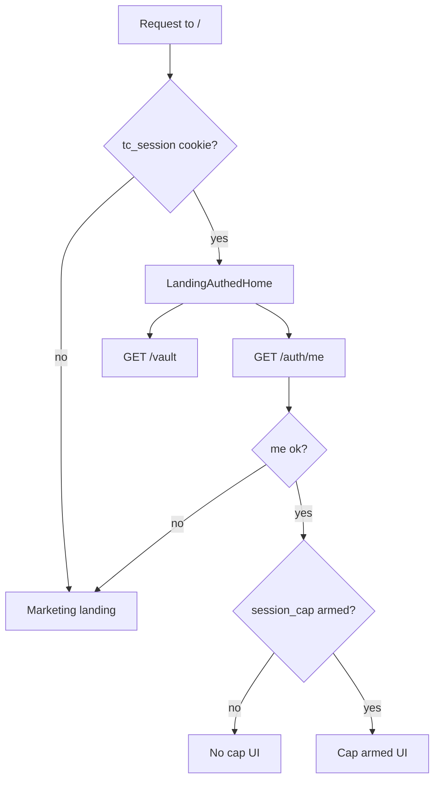

# Logged-In Information Architecture — Hybrid+ (Design Spec)

**Date:** 2026-05-27  
**Status:** Approved  
**Model:** Hybrid+ (public intel stays; authed home pivots; login redirect fixes)  
**Related:** [phases.md](../../phases.md), [2026-06-07-phase-2-protected-session-design.md](./2026-06-07-phase-2-protected-session-design.md)

---

## 1. Problem & goal

**Problem:** After Discord login, the website behaves almost the same as for anonymous visitors. Logged-in users still see the full marketing landing, can open `/login` again, and get no signal about vault or next steps. Only the header avatar changes.

**Goal:** When `tc_session` is present, the site optimizes for the **protected session loop** (configure vault → sync extension → enforce exit) without hiding trust/intel surfaces (casinos, bonuses, tools).

**Non-goals (v1 of this spec):**

- Hiding public routes from authenticated users
- Hard redirect of all authed traffic to `/dashboard`
- Server-side detection of extension install state
- New API endpoints

**Aligns with Phase 2:** Login → vault → extension enforcement remains the staging gate. This spec only changes **web IA and presentation**, not vault or extension contracts.

---

## 2. Route visibility matrix

| Route | Logged out | Logged in | Auth gate |
|-------|------------|-----------|-----------|
| `/` | Full marketing landing | **Command-center home** (Section 3) | Public |
| `/login` | Discord OAuth entry | **Redirect** to safe `redirect` or `/dashboard` | Public (authed redirected) |
| `/dashboard` | Redirect to `/login` | Vault UI | Protected |
| `/settings` | Redirect to `/login` | Profile UI | Protected |
| `/extension` | Install/setup | Same | Public |
| `/casinos`, `/casinos/[slug]` | Trust directory | Same | Public |
| `/bonuses` | Bonus tracker | Same | Public |
| `/tools/*`, `/stake`, `/nuts` | Tools | Same | Public |
| `/touch-grass`, `/legal`, `/privacy`, `/terms` | Legal/info | Same | Public |

**Chrome:** Nav + footer on all routes except existing minimal layouts (`/stake`, `/nuts`).

---

## 3. Authed home command center (`/`)

### 3.1 Trigger

When request includes valid `tc_session` cookie (same check as middleware today: cookie present with non-empty value), render **authed home** instead of marketing landing.

Implementation: server branch in `apps/web/src/app/page.tsx` via `cookies()` from `next/headers`. Client child validates session with `GET /auth/me`; on 401, fall back to marketing landing (stale cookie).

### 3.2 Hidden when authed

Below the command-center hero, **do not render**:

- Three step cards (`coreJobs` grid)
- `LandingSessionMock`

Marketing hero blocks (`LandingHeroActions`, kicker, privacy line) are replaced entirely by the command center — not stacked.

### 3.3 Layout

```
Eyebrow:     Welcome back
H1:          {username} — you're linked.
Lede:        State-dependent (Section 3.4)
Primary CTA: State-dependent
Secondary:   OPEN DASHBOARD (ghost) → /dashboard
Status row:  Two public-page-cards (Vault | Extension)
Tertiary:    Text links — Casino trust · Bonuses · Settings
```

Reuse existing tokens: `landing-page`, `hero-surface`, `landing-shell`, `landing-hero-centered`, `btn-primary`, `btn-ghost`, `public-page-card`.

### 3.4 State machine

Data sources: `GET /auth/me`, `GET /vault` (via `apiFetch`, cookie forwarded).

| State | Condition | Lede | Primary CTA |
|-------|-----------|------|-------------|
| **Loading** | Either request in flight | — | Disabled / skeleton |
| **No vault cap** | No enabled `session_cap` with `durationMinutes` | Set your walk-away line. The extension can't enforce what you haven't configured. | `SET YOUR LINE` → `/dashboard` |
| **Cap armed** | Enabled `session_cap` with minutes | `{N}-minute Touch Grass cap is armed. Play smart or don't play.` | `OPEN DASHBOARD` → `/dashboard` |

Secondary CTA always available: ghost button to `/dashboard`. When primary is already dashboard-oriented, secondary becomes `EXTENSION SETUP` → `/extension`.

### 3.5 Status cards

**Vault card**

- Armed: `Session cap: {N} min` (positive indicator)
- Not armed: `No exit line set` + link to `/dashboard`

**Extension card**

- Fixed copy v1: `Read-only watcher` + link to `/extension`
- Subcopy: `Reload after login so vault rules sync`
- No “installed” badge until extension reports install state (future)

### 3.6 Component boundary

New client component: `LandingAuthedHome.tsx`

- Props: none (fetches own data)
- Exports default view for authed branch
- Marketing content stays in `page.tsx` or extracted `LandingMarketingHome.tsx` if `page.tsx` grows

---

## 4. Navigation (authed)

### 4.1 Header

Unchanged: logo → `/`, avatar → `/settings`, hamburger toggle.

### 4.2 Hamburger order when `user` is set

1. **Account** (moved to top)
   - Dashboard
   - Profile & settings
   - Log out
2. **Quick links** — Extension, Casino Trust, Today's Bonuses, Dashboard (dedupe: remove Dashboard from quick links when Account is shown, or keep once in Account only)
3. **Tools / Intel / Company** — unchanged link sets

**Dedup rule:** When authed, remove `Dashboard` from `NAV_QUICK_LINKS` render (keep in Account only). Avoid two Dashboard entries.

### 4.3 Company group label when authed

Change Company link `{ href: '/', label: 'How it Works' }` to `{ label: 'Command center' }` when user is logged in. Same href (`/`). Logged-out users still see `How it Works`.

### 4.4 Menu footer

Unchanged from today: authed users see username chip → `/settings`; logged-out users see `LOGIN WITH DISCORD`.

---

## 5. Auth redirects

### 5.1 `/login` when already authed

Extend `apps/web/src/middleware.ts`:

- Matcher adds `/login`
- If `tc_session` cookie present → redirect to `redirect` query param when it is a safe relative path (`startsWith('/')` and not `//`), else `/dashboard`
- Do not redirect unauthenticated users (existing login page behavior)

Remove need for client-side-only redirect on login page.

### 5.2 Protected routes

Unchanged: `/dashboard`, `/settings` require cookie; else `/login?redirect={pathname}`.

### 5.3 Post-OAuth landing

Existing Discord callback uses `redirect` query (default `/dashboard`). No change required. Authed users may still manually visit `/` and see command center.

### 5.4 Logout

Existing: `POST /auth/logout`, navigate to `/`. After logout, marketing landing shows again.

---

## 6. Data flow



---

## 7. Error handling

| Case | Behavior |
|------|----------|
| Stale `tc_session` (me 401) | Render marketing landing; optional silent — no toast |
| Vault fetch fails | Show command center with vault card in error/unknown state; link to dashboard |
| Partial load | Show skeleton in hero; status cards populate when data arrives |
| User on `/login` with valid cookie | Middleware redirect before page render |

---

## 8. Testing checklist

**Manual (staging):**

1. Logged out `/` → full marketing hero, step cards, session mock
2. Log in → land on `/dashboard` (or `redirect` target)
3. Visit `/` while authed → command center; no step cards or session mock
4. No cap set → primary CTA `SET YOUR LINE`; vault card shows warning
5. Set cap on dashboard → return `/` → cap armed copy and green vault status
6. Visit `/login` while authed → redirect to `/dashboard`
7. Visit `/login?redirect=/settings` while authed → redirect to `/settings`
8. Log out → `/` shows marketing again
9. Authed hamburger → Account first; no duplicate Dashboard; Company shows `Command center`
10. `/casinos`, `/bonuses` still reachable when authed

**Regression:**

- Middleware still protects `/dashboard` and `/settings` for logged-out users
- Funnel `data-funnel-*` attrs on marketing CTAs unchanged (marketing branch only)

---

## 9. Files to touch (implementation plan input)

| File | Change |
|------|--------|
| `apps/web/src/app/page.tsx` | Server cookie branch; conditional marketing vs authed |
| `apps/web/src/components/LandingAuthedHome.tsx` | **New** — command center UI + data fetch |
| `apps/web/src/middleware.ts` | `/login` authed redirect |
| `apps/web/src/components/SiteNav.tsx` | Reorder groups; conditional quick links + Company label |
| `apps/web/src/app/globals.css` | Optional: `.landing-authed-home` spacing if needed |

No API changes. No nav-menu.ts structural change required if conditionals live in `SiteNav.tsx`.

---

## 10. Open questions (deferred)

- **Extension install telemetry:** Web command center cannot show “synced” until extension pings API or local storage bridge — post Phase 2.
- **Authed marketing override:** Optional `?marketing=1` query to preview full landing while logged in — only if needed for demos; not in v1 scope.

---

## Spec self-review

- [x] No TBD placeholders in scope sections
- [x] Consistent with Phase 2 vault contract (`session_cap` only)
- [x] Single bounded feature set (IA + one new component + middleware tweak)
- [x] Ambiguity resolved: cookie presence gates server render; `/auth/me` confirms; extension install not faked
