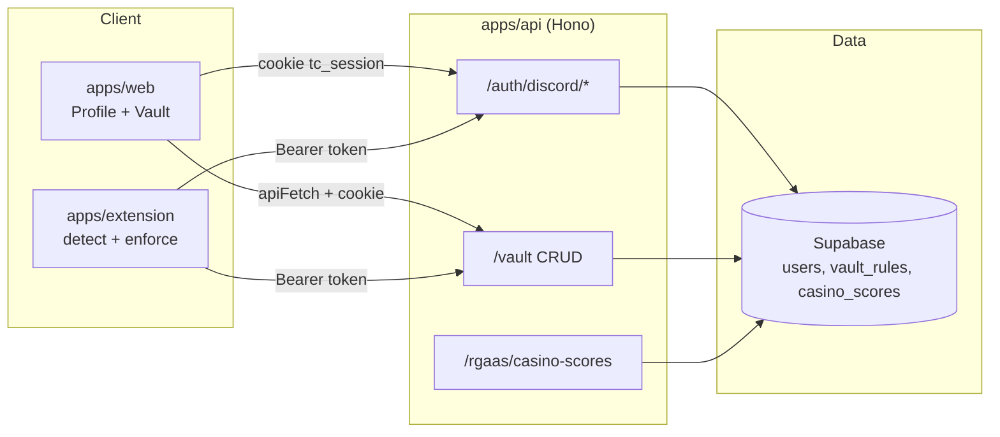
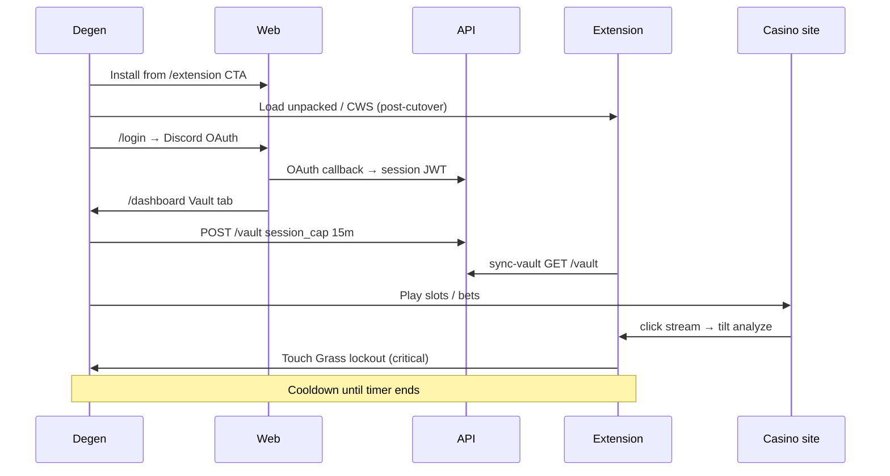

# Phase 2 — Protected Session Loop (Design Spec)

**Date:** 2026-06-07  
**Status:** Approved for staging sign-off  
**Blocks:** Production DNS cutover until staging gate (Section 3) passes  
**Related:** [phases.md](../../phases.md), [cutover-checklist.md](../../cutover-checklist.md), [manual-tasks.md](../../manual-tasks.md)

---

## 1. Problem & goal

**Problem:** Phase 1 proves trust and install intent, but production still relies on the legacy Chrome extension. Users cannot configure vault rules in the new stack or experience enforcement tied to new Supabase data.

**Goal:** One solo degen can complete the **protected session loop** on staging: install → Discord login → set session cap → play on a test casino → **Touch Grass enforcement fires** when tilt hits critical.

**North-star metric:** **Protected sessions** — logged-in users with an enabled `session_cap` rule who receive enforcement at least once per week (post-cutover retention signal).

**ICP at cutover:** Solo degen using the Chrome extension at point-of-play. Dashboard is configuration, not the primary habit surface.

---

## 2. Architecture

### 2.1 System map



### 2.2 Components

| Layer | Responsibility | Key files |
|-------|----------------|-----------|
| **API auth** | Discord OAuth (`web_` / `ext_` state), signed session JWT, `/auth/me` | `apps/api/src/routes/auth.ts`, `session.ts` |
| **API vault** | CRUD for `session_cap` rules; upsert-on-POST for same rule type | `apps/api/src/routes/vault.ts` |
| **packages/db** | Supabase admin client; `listVaultRules`, `createVaultRule`, `updateVaultRule`, `deleteVaultRule` | `packages/db/src/index.ts` |
| **Web dashboard** | Profile + Vault tabs only; session cap minutes → `POST /vault` | `apps/web/src/app/(app)/dashboard/page.tsx` |
| **Extension** | Tilt detection, vault sync, Touch Grass overlay on `critical` | `apps/extension/src/content.ts`, `vault-sync.ts`, `enforcement.ts` |
| **Data** | `vault_rules` table per user; users re-login (no v1 vault migration) | `supabase/migrations/20260527000000_initial.sql` |

### 2.3 Vault API contract (v2 ship gate)

| Method | Path | Auth | Behavior |
|--------|------|------|----------|
| GET | `/vault` | Cookie or `Authorization: Bearer` | Returns `{ rules: VaultRule[] }` |
| POST | `/vault` | Same | Upserts `session_cap`; normalizes `durationMinutes` 1–60 |
| PATCH | `/vault/:id` | Same | Update `enabled` / `config` |
| DELETE | `/vault/:id` | Same | Remove rule; returns updated list |

**v2 constraint:** Only `session_cap` rule type is supported. Other rule types return 400.

**Persistence:** Requires `SUPABASE_URL` + `SUPABASE_SERVICE_ROLE_KEY` on API. Without them, API falls back to in-memory rules (not acceptable for staging sign-off).

### 2.4 Session model

- **Web:** `tc_session` httpOnly cookie set via `/api/auth/complete?token=…` after Discord callback redirect.
- **Extension:** Bearer token in `chrome.storage.local` (`tc_session_token`); `tc_demo: false` when authenticated.
- **Enforcement gate:** Extension enforces only when token present, demo off, and at least one enabled `session_cap` rule in synced vault.

---

## 3. Gate criteria (A gate — staging sign-off)

All items must pass on **staging** before production DNS (Phase 5 / cutover section D).

| # | Criterion | How to verify |
|---|-----------|---------------|
| G1 | API healthy + Supabase wired | `GET /health` → 200; `GET /rgaas/casino-scores` → `source: "supabase"` |
| G2 | Discord OAuth configured | `GET /auth/discord/login` → 302 to Discord; callback creates session |
| G3 | Web login → dashboard | `/login` → Discord → `/dashboard` with `tc_session` cookie |
| G4 | Vault persists | Dashboard Vault tab → Save session cap → refresh → rule still present (`GET /vault` with session) |
| G5 | Extension auth + sync | Staging build → Discord connect → `tc_demo: false` → service worker fetches `/vault` |
| G6 | **Enforcement fires** | Test casino + critical tilt → Touch Grass overlay → betting blocked → SW log `[TiltCheck] Enforcement fired` |
| G7 | CI smoke green | `pnpm test:e2e` passes on `main` |

**Definition: enforcement fires** (from [cutover-checklist.md](../../cutover-checklist.md)):

1. User logged in (`tc_session_token`, `tc_demo: false`).
2. Enabled `session_cap` vault rule from dashboard.
3. Tilt detection reaches **critical** (sustained fast-click pattern).
4. Fullscreen `#tiltcheck-lockdown-root` overlay for configured minutes (default 5).
5. Betting/spin controls disabled until timer ends; no early dismiss.

---

## 4. User flow

### 4.1 Primary loop (habit)



### 4.2 Extension flow (detailed)

1. **Install** — User loads staging build (`EXTENSION_API_URL` = staging API).
2. **Connect Discord** — Popup or sidebar opens API `/auth/discord/login?source=ext`; callback posts `discord-auth-success` with token to opener.
3. **Sync vault** — Background receives `sync-vault` → `GET /vault` with Bearer → stores `tc_vault_rules`.
4. **Detect** — Content script records clicks; `TiltDetector.analyze()` on interval and click.
5. **Enforce** — On `critical` + enabled session cap → `triggerTouchGrassTimeout(description, durationMs)` → message `enforcement-fired` to service worker.

### 4.3 Demo mode (logged out)

- No token → sidebar may show demo state; **no enforcement**.
- Preserves Phase 1 install funnel without requiring login on first open.

---

## 5. PMF moments & habit loop

### 5.1 PMF moments (value realization)

| Moment | Surface | User feeling | Success signal |
|--------|---------|--------------|----------------|
| **Trust before install** | `/casinos/[slug]` | "This site knows which casinos are sketchy" | Time on slug page, extension install click |
| **Commitment** | Discord login | "I'm putting my name on protecting my bankroll" | OAuth completion rate |
| **Agency** | Vault session cap save | "I chose my own lockout — not nanny software" | Vault save without error; return to tweak cap |
| **Intervention** | Touch Grass overlay | "It actually stopped me mid-tilt" | Enforcement event logged; user completes timer |
| **Relief** | Timer ends | "I didn't chase — I stepped away" | Return session within 7d with extension enabled |

### 5.2 Habit loop (Hook model)

| Phase | TiltCheck implementation |
|-------|--------------------------|
| **Trigger** | External: loss streak, fast clicking, late-night session. Internal: "I'm tilting" recognition via sidebar indicators. |
| **Action** | Low friction: extension already running; vault pre-configured. User does not open dashboard mid-session. |
| **Variable reward** | Avoided loss (non-custodial — user keeps winnings they didn't re-bet). Trust score context on sidebar. |
| **Investment** | Session cap minutes tuned over time; Discord identity linked; future Phase 3 analytics/buddies deepen lock-in. |

**Cutover PMF hypothesis:** D30 retention improves when users experience **≥1 enforcement in first 14 days**. Measure protected sessions / WAU, not page views.

---

## 6. Frontend beats (web)

Phase 2 dashboard scope is intentionally narrow.

| Beat | Route / component | Notes |
|------|-------------------|-------|
| Login CTA | `/login` | Single Discord button; redirect param preserved |
| Profile tab | `/dashboard` | Risk profile, notifications, demo mode toggle |
| Vault tab | `/dashboard` | Session cap minutes (1–60), save button, active rules list |
| Status feedback | Inline `status` string | "Vault rule saved — extension will enforce on critical tilt." |
| Auth guard | `middleware.ts` | Unauthenticated `/dashboard` → `/login` |

**Explicitly out of scope (Phase 3):** Analytics, Buddies, Bonuses tabs. Nav must not tease unfinished features.

**Marketing pages unchanged:** `/`, `/extension`, `/casinos` remain Phase 1 surfaces; CTAs drive install + login when user is ready.

---

## 7. Cutover prerequisites (D — speed after gate)

Once gate G1–G7 is green on staging, cutover should be **mechanical** (target: same weekend).

### 7.1 Pre-cutover checklist (parallelizable)

| Item | Owner | Est. |
|------|-------|------|
| Clone Railway env to production services (web + api) | Ops | 30m |
| Production Supabase: migration + `pnpm seed:casino-scores` | Ops | 20m |
| Discord redirect: `https://api.tiltcheck.me/auth/discord/callback` | Ops | 5m |
| DNS: `tiltcheck.me`, `api.tiltcheck.me` | Ops | 15m + propagate |
| `dashboard.tiltcheck.me` → 301 `/dashboard` | Web | 10m |
| Chrome Web Store build with `EXTENSION_API_URL=https://api.tiltcheck.me` | Release | 1–3d review |
| Smoke prod: login → vault → one enforcement | QA | 30m |

### 7.2 Environment parity

Staging and production must differ only by:

- Hostnames (`WEB_URL`, `API_URL`, `NEXT_PUBLIC_*`)
- Supabase project keys
- `SESSION_SECRET` (unique per env)

Same Discord application; both callback URLs registered.

### 7.3 Rollback plan

- Keep v1 monorepo and legacy extension live until CWS update approved.
- DNS rollback: point `tiltcheck.me` back to v1 if enforcement fails in prod smoke.
- Do not archive v1 until 72h stable protected sessions in prod.

### 7.4 v1 parallel ops (non-blocking)

- Email crawler stays on v1 with `CRAWLER_API_URL=https://api.tiltcheck.me`.
- `/bonuses` proxy may use upstream v1 inbox; empty inbox is not a Phase 2 blocker.

---

## 8. Success metrics

### 8.1 Staging gate (binary)

- All G1–G7 criteria pass once manually on staging Railway hostnames.

### 8.2 Post-cutover (30-day)

| Metric | Target (PMF zone) | Tooling |
|--------|-------------------|---------|
| Protected sessions / WAU | >30% of logged-in WAU | Phase 3 analytics (defer instrumentation) |
| Vault save rate | >60% of new logins within 7d | Supabase `vault_rules` count / new users |
| Enforcement events / active ext users | >1 per user per 14d (power users) | Extension SW logs → future telemetry |
| Sean Ellis "very disappointed" | >20% | Survey post-enforcement |
| D7 extension retention | >40% | Chrome Web Store analytics |

### 8.3 Anti-metrics (do not optimize at Phase 2)

- Raw marketing traffic without install
- Casino score lookups without extension install
- Dashboard time without vault save

---

## 9. Testing

### 9.1 Automated (CI)

`pnpm test:e2e` (Playwright):

- API health + casino-scores array non-empty
- Home, casinos, login link visible
- `GET /vault` and `POST /vault` return **401** without auth

Optional: `E2E_DISCORD=1` for live OAuth (manual secret; not required in CI).

### 9.2 Staging API smoke (no session)

Verified 2026-06-07 against `https://tiltcheck-api-production.up.railway.app`:

| Request | Expected | Result |
|---------|----------|--------|
| `GET /health` | 200 `{ ok: true }` | **Pass** |
| `GET /rgaas/casino-scores` | 200, `source: "supabase"` | **Pass** (100+ casinos) |
| `GET /vault` | 401 `{ error: "Unauthorized" }` | **Pass** |
| `POST /vault` (no auth) | 401 | **Pass** |
| `GET /auth/discord/login` | 302 redirect | **Pass** |

### 9.3 Vault API manual test (authenticated)

Requires Discord session. Run after web deploy is live.

1. **Login via web**
   - Open `{WEB_URL}/login` → complete Discord OAuth.
   - DevTools → Application → Cookies → confirm `tc_session` on web domain.

2. **GET vault (browser console on dashboard)**
   ```javascript
   fetch(`${location.origin.replace('3000','3001')}/vault`, { credentials: 'include' })
   ```
   Or use dashboard Network tab: `GET /vault` via Next proxy → expect `{ rules: [] }` or existing rules.

3. **POST session cap**
   - Dashboard → Vault tab → set minutes → **Save session cap**.
   - Expect 200/201; status message confirms save.
   - Hard refresh → minutes and rule list unchanged.

4. **Verify Supabase**
   - Supabase Table Editor → `vault_rules` → row for your `user_id`, `rule_type = session_cap`.

5. **Extension sync**
   - Connect Discord in extension popup.
   - DevTools → Extension service worker → confirm vault fetch succeeded.
   - `chrome.storage.local.get(['tc_vault_rules'])` includes `session_cap` with matching minutes.

6. **Enforcement**
   - Open allowed test casino tab.
   - Rapid-click until critical (or use documented test pattern).
   - Confirm Touch Grass overlay + SW log `[TiltCheck] Enforcement fired`.

**curl with session (advanced):**

```bash
# After copying tc_session cookie value from browser:
curl -s -H "Cookie: tc_session=YOUR_JWT" \
  "https://tiltcheck-api-production.up.railway.app/vault"

curl -s -X POST -H "Cookie: tc_session=YOUR_JWT" \
  -H "Content-Type: application/json" \
  -d '{"ruleType":"session_cap","enabled":true,"config":{"durationMinutes":15}}' \
  "https://tiltcheck-api-production.up.railway.app/vault"
```

Extension builds use Bearer instead of cookie:

```bash
curl -s -H "Authorization: Bearer YOUR_JWT" \
  "https://tiltcheck-api-production.up.railway.app/vault"
```

---

## 10. Deferred — Phase 3 polish

Not required for DNS cutover. Ship in order after production Phase 2 stable:

| Item | Rationale |
|------|-----------|
| **Analytics tab** | Retention dashboards; enforcement event ingestion |
| **Buddies** | Social accountability; simplified v1 port |
| **Bonuses tab** | Full inbox list; public `/bonuses` picks already partial |
| **Additional vault rule types** | Loss limits, deposit caps — API currently rejects non-`session_cap` |
| **Discord bot** | `/vault status`, alert webhook (Phase 5 partial exists) |
| **Tools** | session-stats → verify → house-edge (Phase 4) |
| **Enforcement telemetry** | Product analytics for protected session metric |
| **Custom staging DNS** | `staging.tiltcheck.me` / `api-staging.tiltcheck.me` — optional before cutover |

---

## 11. Open items

| Item | Status |
|------|--------|
| Web Railway hostname | Confirm in Railway dashboard; set `WEB_URL` / `NEXT_PUBLIC_*` to match |
| Staging manual gate G3–G6 | Pending human sign-off |
| Chrome Web Store staging sideload | Unpacked extension OK for gate |

---

## Appendix: vault route implementation notes

- `POST /` upserts when same `ruleType` exists (update, not duplicate).
- `durationMinutes` clamped 1–60; legacy `maxMinutes` accepted as alias.
- Auth via `getAuthUserFromRequest(cookie, authorization)` — supports both web and extension clients.
